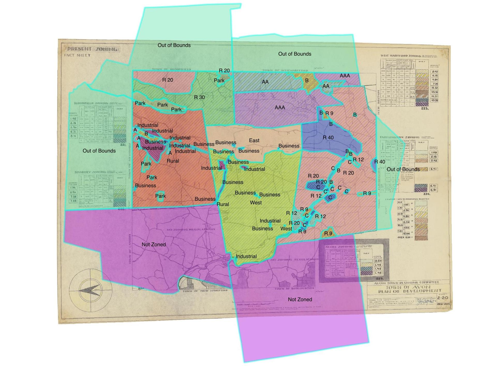

# olt-zoning-metro-hartford
Interactive Map: Exclusionary Zoning in Metro Hartford CT, mid-1950s; focusing on Avon, Bloomfield, West Hartford. Repo also includes georeferenced zoning maps and GeoJSON files for Avon, Bloomfield, West Hartford, and portions of Farmington, Simsbury, and also includes non-georeferenced zoning maps (JPG/PDF only) for many towns in metro Hartford region, 1950s-60s.

Interactive map displays `combined-zoning-1950s.geojson`, a simplified combined residential zoning map of "the mid-1950s" that merges selected data from three different maps, using a common unit of measurement (minimum land required per family, in square feet). This combined geojson is comprised of:

- `avon-zoning-1953.geojson` to display residential zoning in Avon 1953 (Fall) from the regional map labeled `avon-area-zoning-1954.geojson` (published in January 1954). According to map legend, Avon (east) minimum land per family is 2 acres (about 87,000 sq ft), and Avon (west) is 30,000 sq ft. We chose not to display Farmington 1950 and Simsbury 1952 data from the `avon-area` file because these were partial maps, and the Avon data legend did not clearly define minimum land per family requirements for every residential zoning unit in these towns. Also, we replace the Bloomfield 1950 partial data and West Hartford 1951 partial data from this area map with more complete data from 1958 town maps below.
- `bloomfield-zoning-1958.geojson` to display residential zoning in Bloomfield 1958. Note that R-40 is coded at 40,000 sq ft of minimum land per family, etc. RB-20 is both residential and business, and coded as 20,000 sq ft in this residential map.
- **to come** `west-hartford-zoning-1958.geojson` to display residential zoning in West Hartford 1958. **TODO** code AAA, etc...
- For all three geojson files, non-residential zones (industrial and business-only) and non-zoned areas are coded as "na" and are not displayed in this residential zoning interactive map.
- Note that zoning areas as residential at one point in time does not necessarily mean that homes will be constructed there, and some areas may be rezoned to industrial/business or other uses in the future.

## Live map
https://ontheline.github.io/otl-zoning-metro-hartford/index-caption.html

## Credits
Interactive map developed by Jack Dougherty and Ilya Ilyankou / Picturedigits for On The Line, http://OnTheLine.trincoll.edu, Trinity College, Hartford CT.

See also https://ontheline.github.io/otl-zoning-west-hartford/index-caption.html

## Dependencies
- Leaflet https://leafletjs.com
- jQuery https://jquery.com/
- Esri Leaflet for Esri imagery and labels https://github.com/Esri/esri-leaflet/
- FontAwesome https://fontawesome.com
- Leaflet.ExtraMarkers https://github.com/coryasilva/Leaflet.ExtraMarkers

## TODO
- display the map! I think I'm doing something wrong with `choroplethStyle` or `choroplethLayer`, perhaps because `minlandfam` is numeric and I'm using syntax for string variables?
- finalize color scheme that also works well with 1924 WH map and diagram
- design new legend to match data
- add onEachFeature to display town,zone,year of each polygon when clicked or on hover?
- decide if Town Boundaries (including Hartford and others) should appear on this map
- decide if Star should appear for State Capitol
- decide if FA and Extramarkers can be removed from this map, since replaced by onEachFeature
- do calculations of amount and percentage of land allocated to residential type by town
- decide if calculations should manually remove park area (such as Pennfield state park in Bloomfield) or keep as-is on zone map

## Map Summary
* Avon 1951 (JPG only)
* Avon area 1954 (georeferenced & in GeoJSON)
* Avon 1964 (JPG only)
* Bloomfield 1958 (georeferenced & in GeoJSON)
* Farmington 1961 (PDF only) - see earlier on 1954 Avon map
* Glastonbury 1959 (PDF only) - see 1956 at CSLib; PDF only)
* Granby 1960 (PDF only)
* Hartford 1945 (JPG only)
* Hartford 1962 (PDF only) - see 1956 at CSLib or UConn
* Newington 1954 (PDF only) - see 1957 from PSU
* Simsbury 1958 (PDF only) - see earlier on 1954 Avon map, or 1957 CSLib map
* West Hartford 1958 (PDF only)
* Windsor 1961 (PDF only)

See additional West Hartford zoning maps in https://github.com/ontheline/otl-zoning-west-hartford

## Historical subfolder

- Avon, “Town of Avon Zoning Map” (Map 066, Marian Hunter History Room, Avon Free Public Library, November 1951), http://hdl.handle.net/11134/150002:4122.

- Avon, “Present Zoning Fact Sheet [map of Avon and adjacent towns]” (Joseph Moschner and Avon Town Planning Committee, Connecticut, January 1954), https://www.avonct.gov/planning-community-development/files/1956-pocd-maps-908, scanned by Town of Avon. Includes zoning data for these towns (dates):
  - Avon (amended Oct 19, 1951, and Fall 1953)
  - Bloomfield (adopted March 15, 1950)
  - Farmington (adopted April 27, 1950)
  - Simsbury (adopted Nov 21, 1952)
  - West Hartford (amended to Dec 3, 1951)
  - Burlington and Canton (not zoned as of late 1953)

- Avon, “Avon Revised Zoning Map” (Technical Planning Associates; Map 056, Marian Hunter History Room, Avon Free Public Library, 1964), http://hdl.handle.net/11134/150002:4122.

- Bloomfield, “Zoning Map of the Town of Bloomfield, Connecticut” (Town Plan and Zoning Commission, June 30, 1958), http://www.worldcat.org/oclc/435838841, scanned by University of Kansas map library.

- Farmington, “Zoning Map: Farmington, Connecticut” (Town Planning Dept, 1961), http://www.worldcat.org/oclc/435838863, scanned by University of Kansas map library.

- Glastonbury, “Building-Zoning Map, Glastonbury, Connecticut,” June 1959, http://www.worldcat.org/oclc/435838832, scanned by University of Kansas map library.

- Granby, “Zoning Map of Granby, Connecticut.” (Technical Planning Associates, 1960), http://www.worldcat.org/oclc/435838864, scanned by University of Kansas map library.

- Hartford, “Zoning Map of the City of Hartford” (Department of Engineering, 1945), http://hdl.handle.net/11134/50002:10930, scanned by Hartford Public Library, CT Digital Archives.

- Hartford, “Zoning Map of the City of Hartford [Connecticut]” (City of Hartford. Department of Engineering, June 1, 1962), http://www.worldcat.org/oclc/435838873, scanned by University of Kansas map library.

- Newington, “Zone Map: Town of Newington, Connecticut” (Zoning Commission, June 21, 1962), http://www.worldcat.org/oclc/435841790, scanned by University of Kansas map library.

- Simsbury, “Simsbury [Zoning Map] Connecticut,” October 30, 1958, http://www.worldcat.org/oclc/435835109, scanned by University of Kansas map library.

- West Hartford, “Zoning Map: West Hartford, Connecticut” (Town Plan and Planning Commission, December 1958), http://www.worldcat.org/oclc/435841829, scanned by University of Kansas map library.

- Windsor, “Zoning Map: Town of Windsor, Connecticut” (Dr. Joseph R. Moschner & Associates, November 8, 1961), http://www.worldcat.org/oclc/190825516, scanned by University of Kansas map library.

### Requested from Penn State map library
Newington, “Zone Map: Town of Newington Connecticut” (Town of Newington, 1957), http://www.worldcat.org/oclc/61219552.

## Minimum Land Required Per Family by Town Zoning in early 1950s

| Town (section)         | Square Ft | Acres |
|:-----------------------|----------:|------:|
| Avon (east)            | 87,000    | 2.0   |
| Avon (west)            | 30,000    | 0.7   |
| Farmington (northeast) | 40,000    | 0.9   |
| Farmington (west)      | 20,000    | 0.5   |
| Bloomfield (west)      | 30,000    | 0.7   |
| Simsbury               | 25,000    | 0.6   |
| West Hartford (west)   | 10,000    | 0.2   |
| Burlington             | not zoned | n/a   |
| Canton                 | not zoned | n/a   |

Sources: Zoning Regulations for Avon (amended Oct 19, 1951, and Fall 1953); Bloomfield (adopted March 15, 1950); Simsbury (adopted Nov 21, 1952); West Hartford (amended to Dec 3, 1951); Farmington (adopted April 27, 1950), adapted from Avon and Joseph Moschner, “Present Zoning Fact Sheet [Map]” (Avon Town Planning Committee, Connecticut, January 1954), https://www.avonct.gov/planning-community-development/files/1956-pocd-maps-908.

## Georeferencing (Avon 1954)
Export PDF to JPG or PNG, and georeference the image using [QGIS Georeferencer](https://docs.qgis.org/3.16/en/docs/user_manual/working_with_raster/georeferencer.html) tool.

For Avon 1954, about 20 ground control points were chosen (available in `georeference/1954-avon-present-zoning-ROTATED_modified.tif.points`). The output GeoTIFF is available from `georeference/1954-avon-present-zoning-ROTATED_modified.tif`.

To recreate GeoTIFF from the original JPG and GCP points in QGIS, follow the steps below:

1. Open the JPG map in Georeferencer.
1. Load GCP points file.
1. In Transformation Settings, set type to *Polynomial 2*, resampling method to *Nearest neighbor*, and target SRS to *EPSG:3857* (Web Mercator).
1. Hit *Play* to generate a GeoTIFF.

## Creating a GeoJSON
The GeoJSONs were created using georeferenced TIFF maps. Polygons were manually created in QGIS, sometimes using simplified town boundaries of Connecticut (available from `georeference/ct-towns.geojson`).

Each polygon contains three properties:
* town
* zone
* acres (rounded to 1 decimal)

## License
MIT.
